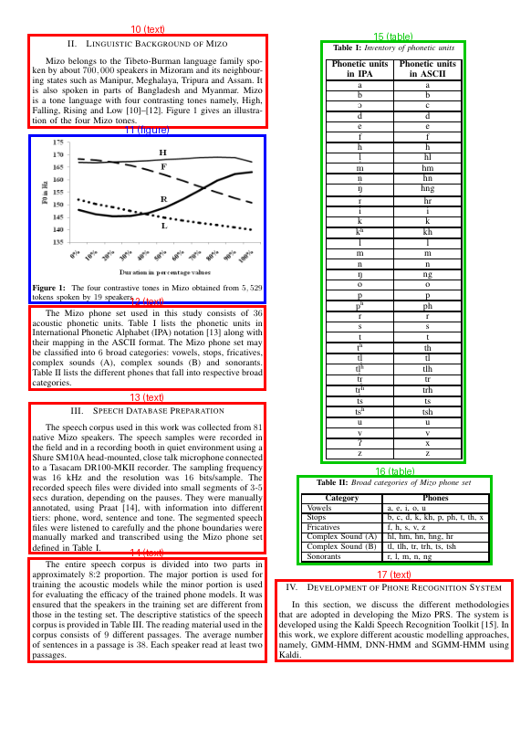
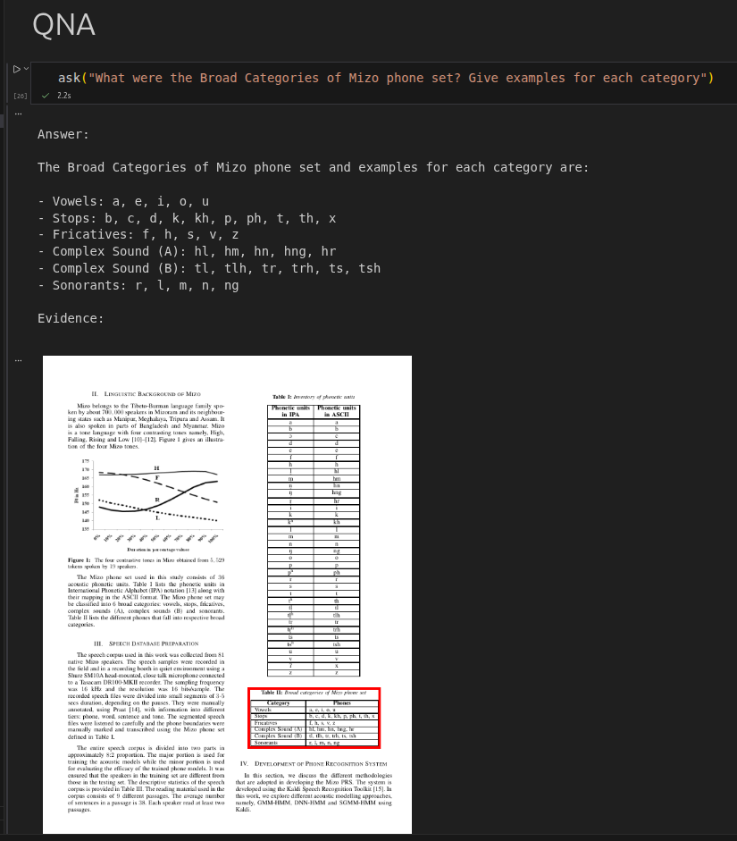

## Layout-Aware RAG for Research Papers using LandingAI ADE

**Author: Abhishek Dey**

## About:

This project demonstrates a **layout-aware Retrieval Augmented Generation (RAG)** pipeline for research papers. 
Instead of treating documents as plain text, this pipeline preserves **document layout context** such as **tables, text blocks, and their positions in the PDF**.

The system can answer questions about a research paper and **highlight the exact region in the document where the answer was retrieved from**.

---

## Motivation

Traditional RAG pipelines often ignore document structure. However, research papers contain important information in:

- Tables
- Figures
- Section layouts
- Structured paragraphs

Ignoring layout can lead to **poor retrieval and hallucinated answers**.

This project uses **LandingAI ADE (Agentic Document Extraction)** to extract structured chunks from a PDF while preserving **layout metadata such as bounding boxes and page numbers**.

## Features

- Layout-aware document parsing
- Table-aware retrieval
- Vector search using ChromaDB
- Question answering using LLMs
- Visual grounding of retrieved evidence
- Works on research papers and structured PDFs

---
## Tech Stack

- **LandingAI ADE** – document parsing and layout extraction  
- **ChromaDB** – vector database  
- **OpenAI Embeddings** – semantic search  
- **LangChain** – RAG orchestration  
- **PyMuPDF** – PDF rendering and visualization  
- **Python**

---

## Sample Layout aware extracted chunks

<p align="left">

</p>

## Sample RAG output

<p align="left">

</p>

## Create Virtual environment

```
uv venv

source .venv/bin/activate

uv pip install -r requirements.txt
```

## Take API keys from 

- OpenAI

- Langsmith

- LandingAI

## Create a .env file 

```
OPENAI_API_KEY="sk-xxxxxxxxxxxxxxxxxxxxxxxxx"
LANGSMITH_API_KEY="lsv2_pt_xxxxxxxxxxxxxxxxxxxxxxxxxxxx"
VISION_AGENT_API_KEY="pat_xxxxxxxxxxxxxxxxxxxx"
```

## Notebook:

- [rag_pipeline.ipynb](rag_pipeline.ipynb)

## References:

-  [LandingAI Website](https://landing.ai/)

-  [LandingAI Documentation](https://docs.landing.ai/)

-  [LandingAI Github repo](https://github.com/landing-ai/ade-python) 

-  [Document AI: From OCR to Agentic Doc Extraction](https://www.deeplearning.ai/short-courses/document-ai-from-ocr-to-agentic-doc-extraction/)

